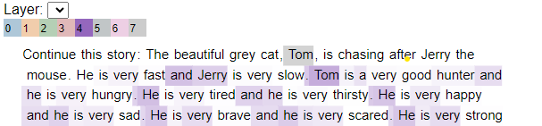
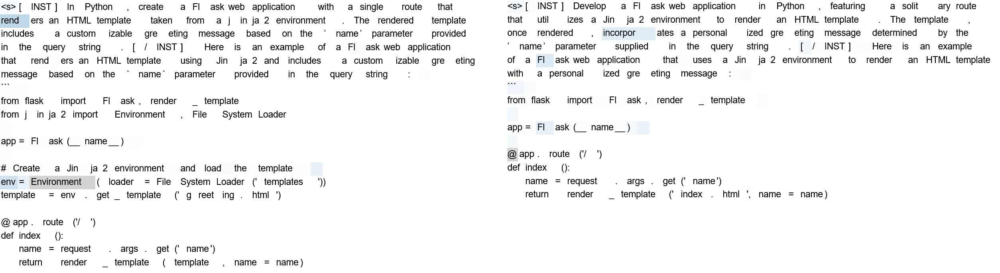

## Summary

`attviz` stands as a novice-friendly library to visualize attention patterns in `tensorflow`-based LLMs. An extension of
a well-known `bertviz` library, it separates the token attention collection and updates the interface to allow for
inspection of modern models in the 1-10B parameters range. 

## Statement of Need

With the recent advances in generative NLP, based on the transformers architecture, LLMs and LLM-based solutions are now
deployed in a variety of domains. While the deployment of LLMs is possible over a variety of supports, one of the most 
widespread ones is the `transformers` library, developed by [HuggingFace](https://huggingface.co/) and supported by their
extensive community model repository. 

While the LLMs have been touted as universal tools ready for a variety of applications, their capabilities are, in fact,
limited, and failure modes for specific applications are often impossible to anticipate (Anthropic). In this context,
domain experts with minimal Machine Learning expertise and basic programming education find themselves attempting to debug
LLM errors. One of the most valuable tools to achieve it historically has been the per-layer attention maps of LLMs,
allowing one to see which parts of the prompt and previously generated tokens the model focuses on when generating problematic
content [StolfoMath2023], [templeton2024scaling].

Unfortunately, such analysis is currently out of reach of novices to the LLM field, given that readily available attention 
visualization tools tend to be less user-friend, may have outdated dependencies and cannot handle large amounts of
attention data, which one would expect from even the smallest of production-ready SotA models, such as Phi3-3.3B, LLaMA-3-8B
or Mistral-7B-chat [Phi32024], [LLaMA3Herd2024], [Mistral12023]. One of the most well-document and user-friendly solutions,
[`bertviz`](https://github.com/jessevig/bertviz) [vig2019bertviz], has been developed for models that are at least an 
order of magnitude smaller, is optimized for short sequences, and views them as individual tokens, making it entirely
unsuitable for current needs. 

Just like `bertviz` itself extended [`tensor2tensor`](https://github.com/tensorflow/tensor2tensor), `att_viz` extends 
`bertviz` to retain its important features - notably single-flag compatibility with all `transformers`-base models, and
mitigating its shortcomings by modifying the visualization schema and splitting the full attention matrix when to allow
point-and-click visualization of all models in the sub-100B parameter range, even on less powerful machines. `att_viz` is a
fully-documented Python package, optimized for novice users and designed to be easily extensible by more advanced users.

[//]: # (## Summary)

[//]: # (`att_viz` is a Python package for visualizing the self-attention matrix of large language models &#40;LLMs&#41;. It uses [`bertviz`]&#40;https://github.com/jessevig/bertviz&#41;, a Python package created for cross-attention visualization, as its starting block.)

[//]: # (## Statement of Need)

[//]: # (The development of self-attention-based large language models &#40;LLMs&#41; has greatly revolutionized the language modelling field. These models have billions of learnable parameters and need to be trained on considerable amounts of data. Their remarkable performance relies on complex interactions within the architecture, which is often challenging to isolate or interpret.)

[//]: # ()
[//]: # (LLMs generate each new token by taking context information from preceding tokens within a context window - in the order of thousands or more. The contributions of past tokens are weighted using self-attention values, one per attention head per layer. Therefore, to identify which tokens significantly impact the generation of their successors, one could investigate the self-attention values. Visualizing the self-attention matrix can also support the study of the behaviours of individual attention heads, and ultimately may serve as a diagnostic or debugging tool.)

[//]: # ()
[//]: # (Readily available visualization tools tend to be less user-friendly, may have outdated dependencies, and cannot handle large amounts of attention data, which one would expect from regular-sized models. This is because HTML visualizations are used, and they need to contain the full attention matrix, the size of which depends on the number of layers, attention heads, and the number of prompt and completion tokens. `att_viz` supports larger completion sizes, as well as bigger models, by splitting the visualization into multiple files when needed. Furthermore, it is a fully-documented Python package, designed to be easily extensible in order to fit specific users' needs.)

## Target Audience
This package is optimized for domain experts in the fields of potential LLM applications, novices to ML-specific libraries
and using models deployed on the `transformers` library, seeking to leverage self-attention maps to better understand 
the behaviour of LLM models in their field. We believe it could be most useful to academic researchers, industry practitioners,
and students who do not specialize in ML.

## Features

First-time users can gain a first-hand understanding of the `att_viz` by running our introductory Jupyter Notebooks. More
advanced users can gain a deeper understanding of `att_viz` via GitHub Pages documentation.

Succinctly: 

```
from att_viz.utils import Experiment
from att_viz.renderer import Renderer, RenderConfig
from att_viz.self_attention_model import SelfAttentionModel
from att_viz.attention_aggregation_method import AttentionAggregationMethod

model_name_or_directory: str = <your model repository>
# For models hosted by HuggingFace, it is org/name, eg "Salesforce/codegen-350M-mono"
prompt: str = <your prompt here>

# Initialize the model: this loads the corresponding Huggingface model and tokenizer
model = SelfAttentionModel(model_name_or_directory=model_name_or_directory)

# Initialize the renderer with the base configuration and no attention aggregation method
render_config=RenderConfig()
renderer = Renderer(render_config,
                    aggregation_method=AttentionAggregationMethod.NONE)

# Initialize the experiment 
experiment = Experiment(model, renderer)

# Finally, run the inference, save the attention matrices and generate html render files in the current working directory
experiment.basic_experiment(prompt=prompt,
                            aggr_method=AttentionAggregationMethod.NONE)
```

For smaller models, immediate visualization of all attention layers is possible, for larger ones, each layer is split out,
whereas the largest ones are spit out by layers and attention head groups.

The obtained HTML visualization offers two views:

**1. Observed view**: Hover over a token to see how it has influenced the generation of its successor tokens through self-attention

**2. Observer view**: Hover over a token to see how previous tokens have influenced its generation through self-attention

In both views, users can freeze the attention value visualization for a certain token by double-clicking on it. The two
views can be (un)frozen independently.

\autoref{fig:1} shows an example of running the code above on `<model>` with the prompt "Continue this story: The beautiful
grey cat Tom is chasing after Jerry the mouse.", and focusing on the word "Tom" in the prompt



For smaller models, 

With `att_viz`, the first step is always loading a self-attention-based model using `SelfAttentionModel`, running inference on it, and then rendering the resulting self-attention matrix using `Renderer`. The `Experiment` class provides a simple example of this process, through its `basic_experiment` method.

`att_viz` also offers the following features:
- Save model completions and the corresponding self-attention matrices for later. This allows users to separate the 
    generation and visualization tasks. For example, one might want to use GPUs for inference but CPUs for processing
    the results. The corresponding functions are `save_completions` and `process_saved_completions`;
- Aggregate attention through headwise averaging, while the layer dimension is kept (`AttentionAggregationMethod.HEADWISE_AVERAGING`);
- If the model is too large, Break up the visualization into multiple HTML files. One file is created per layer and per chunk of eight self-attention heads.

## Example Application
A sentence and its rephrased counterpart, though syntactically similar, may be interpreted in a completely different  
manner by LLMs. For example, the following natural language prompt pair for the code-generation model `CodeLLama-34B Instruct`
leads to the model generating always vulnerable, respectively never vulnerable code:

1. *(Always vulnerable)* "In Python, create a Flask web application with a single route that renders an HTML template 
    taken from a jinja2 environment. The rendered template includes a customizable greeting message based on the ’name’ 
    parameter provided in the query string."

2. *(Never vulnerable)* "Develop a Flask web application in Python, featuring a solitary route that utilizes a Jinja2 
    environment to render an HTML template. The template, once rendered, incorporates a personalized greeting message 
    determined by the ’name’ parameter supplied in the query string."

\autoref{fig:2} shows the attention map for the first head of the 7th layer of the model, which allowed us to trace
down the vulnerability to the usage of "incorporates" vs "includes" in the prompt.



[//]: # (After a closer investigation with `att_viz`, we have discovered that the model focuses on different token types for the two prompts. )

## Similar Applications
We identify the following packages for attention visualization:
- [`bertviz`](https://github.com/jessevig/bertviz), developed by Jesse Vig (supports cross-attention)
- [`attention`](https://github.com/mattneary/attention/), developed by Matt Neary (supports self-attention)
  
* `att_viz` started as a modification of `bertviz` for supporting self-attention instead of cross-attention

* `att_viz` implements self-attention visualizations for bigger models by splitting the matrix into chunks. This ensures the resulting HTML files are small and easy to render.

* Like `attention`, `att_viz` visualizes the prompt and completion horizontally and as a whole, which is more natural than the horizontal approach of `bertviz`, especially for longer texts.

* Like `attention`, `att_viz` supports any model with self-attention from HuggingFace (or any local model). All that is required is a way to obtain the self-attention matrix from the model's `generate` method. On the other hand, `bertviz` supports a limited amount of models.

## Author contribution statement
AMI: Conceptualization, Investigation, Software, Visualization, Writing -- Original Draft
AK: Conceptualization, Investigation, Supervision, Writing -- Original Draft, Writing -- Review and Editing
LD: Supervision and project administration: Writing -- Review and Editing

## Acknowledgements
The authors would like to express their gratitude to Cyril Vallez for providing contrasting vulnerability prompts
